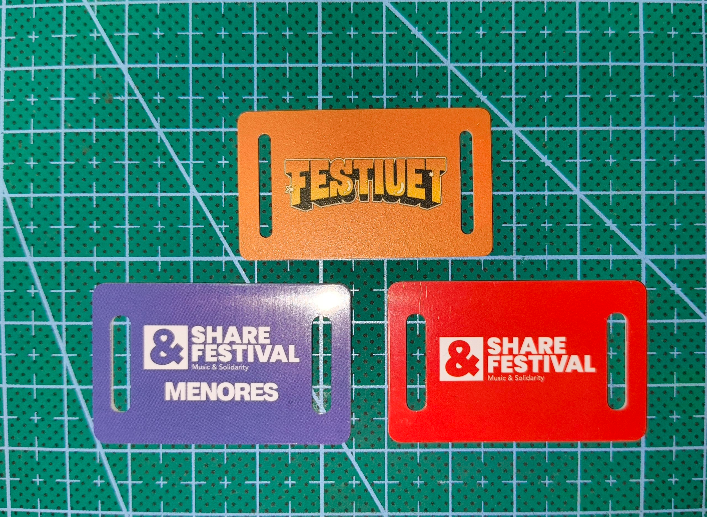
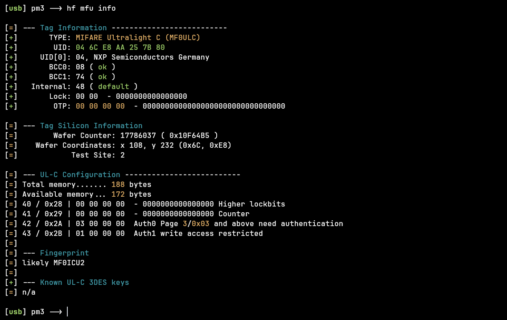
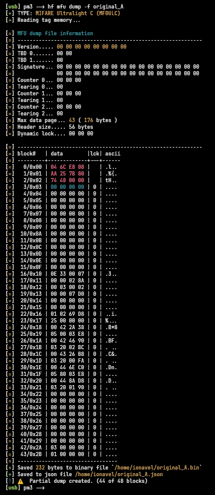
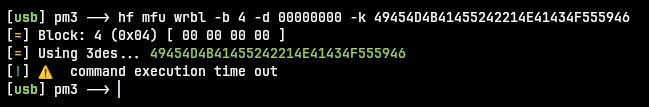
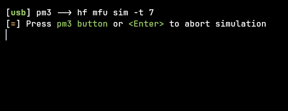
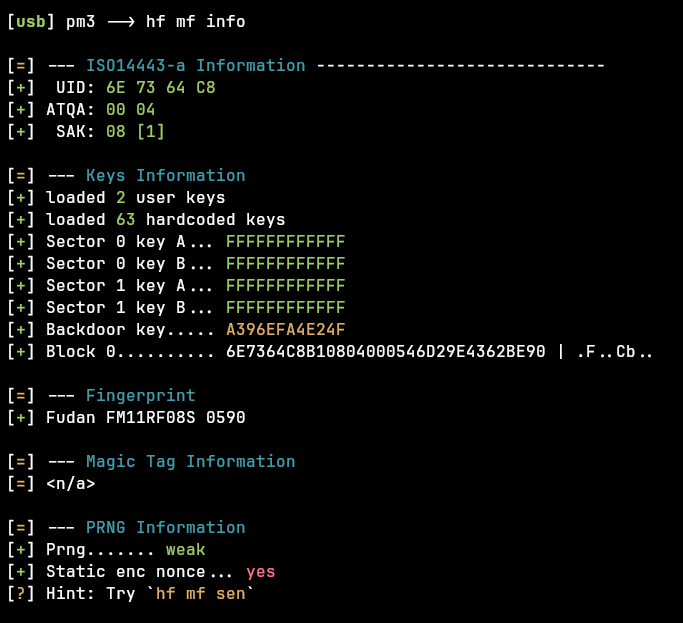
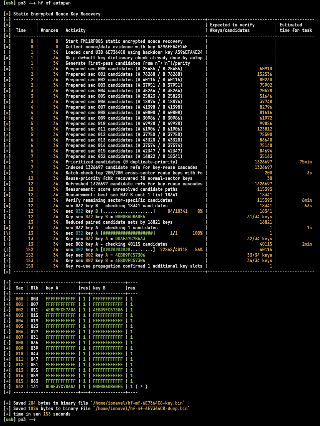

Every festival sells you the same setup: top up a wristband, pay with it at the bars. The interesting security question isn't "can I read it" — it's **can I clone it, and does the clone let me spend the same money twice?** I kept the wristbands from two different festivals and took them apart to find out. The short answer: cloning is trivial on one of them and near-complete, but turning that into stolen money runs straight into something I can't see from the outside — the server.

> ⚠️ **Scope and ethics:** everything here is on my own hardware, with both festivals already over, for a defensive write-up. There's no recipe for spending anyone else's balance. One of these systems (Idasfest) is a live platform, so identifiers and the real PINs are redacted, and the double-spend part stays at the threat-model level.

# What I'm using

Two systems that look nothing alike under the hood:

- **System A — a festival on MIFARE Ultralight C (UL-C).** NXP chip, page-based memory, 3DES authentication required to write.
- **System B — Festiuet, running the Idasfest payment platform, on Fudan MIFARE Classic 1K (FM11RF08S).** Different chip, different family, and — as it turns out — a hardware backdoor.

The hardware is the usual: my Proxmark3 (the cheap Chinese clone I set up in [the previous post](https://ionavel.github.io/posts/starting-with-proxmark/)) on Ubuntu, a Flipper Zero for quick reads, and a couple of magic cards to clone onto.



# The clone ceiling: it's all about the write key

Before the two case studies, here's the idea the whole post hinges on. **Cloning readable data is almost always possible.** What decides whether a clone is _useful_ is whether you can also reproduce the secret the terminal uses to **write** to the card — because a payment terminal debits your balance by writing a new value back. If you can't reproduce that write path, your clone is a read-only snapshot: it looks identical but goes stale the moment the real card is used.

That single distinction splits my two systems cleanly, so let's look at each.

# System A: MIFARE Ultralight C — the clone that can't be spent

## Recon and dump

`auto` confirms it's HF, and `hf mfu info` identifies it:



The line that matters is **`Auth1 write access restricted`**: reading is free, only writing needs the 3DES key. So the full dump goes through without a key — except it comes back **`44 of 48 blocks`**:



The 4 missing blocks are pages `0x2C–0x2F`, the **3DES key**, which is write-only and reads back as zeros. The Proxmark is telling me straight: I can copy everything except the one secret that matters.

(For completeness on the data: the balance sits in cleartext at page `0x11` in cents, and a short transaction log lives at `0x18–0x21`. That's a privacy problem — anyone with a phone reads your balance and spending history — but it's not the focus here.)

## Proving the write is locked

I try to write an empty block with the _default_ 3DES key:

```
[usb] pm3 --> hf mfu wrbl -b 4 -d 00000000 -k 49454D4B41455242214E41434F555946
```



`command execution time out` — auth fails, the operator set a custom key, and I can't write. And since the dump never contained that key, **any clone I make will lack it too.**

## Cloning by emulation

I don't own a UL-C magic tag (my magics are all Classic, a different family), so instead of writing to a physical tag I emulate from the dump:

```
[usb] pm3 --> hf mfu eload -f original_A
[usb] pm3 --> hf mfu sim -t 7
```



📸 TODO: read the emulated card back with the Flipper (same UID, same balance).

Here's the ceiling in action. The emulated card reproduces every readable page — UID, balance, history — perfectly. But it does **not** have the 3DES key. So a terminal that tries to authenticate and decrement the balance would fail against my clone. **System A's clone is a convincing read-only replica and nothing more.** You can't spend it, and you can't double-spend it, because the terminal can't write to it.

# System B: Festiuet / Idasfest — the near-complete clone

## The Fudan backdoor

This wristband is a MIFARE Classic 1K, but `hf mf info` drops two bombshells:

```
[+]  UID: 6E 73 64 C8
[+] Backdoor key..... A396EFA4E24F
[+] Fudan FM11RF08S 0590
```

It's a **Fudan FM11RF08S**, and it carries a **hardware backdoor**. In 2024 Philippe Teuwen (Quarkslab) published that this chip ships with a factory backdoor key (`A396EFA4E24F`) common across the whole production run — with it, you recover **every** key on the card in minutes, knowing nothing to start. The operator did set custom keys (I recovered `4EBD9FC57306` on sector 2), but the backdoor makes that irrelevant.

`hf mf info` and `hf mf autopwn` captures.



## Cloning it — for real this time

Because the sector key is _recoverable_, the whole card — data **and** keys — can be copied to a plain Gen1a magic Classic 1K:

```
# original band -> recover keys + dump
[usb] pm3 --> hf mf autopwn

# swap to the Gen1a magic 1K, confirm it's magic
[usb] pm3 --> hf 14a info          # "Magic capabilities... Gen 1a"

# clone the full dump (UID + all 16 sectors, keys and access bits included)
[usb] pm3 --> hf mf cload -f hf-mf-6E7364C8-dump

# verify
[usb] pm3 --> hf 14a info          # same UID 6E:73:64:C8
[usb] pm3 --> hf mf cview
```

📸 TODO: clone captures (`hf 14a info` on the magic showing UID `6E:73:64:C8`, and the `cview` comparison).

This is the crucial difference from System A. The clone carries the sector-2 key too, so a terminal **can authenticate and write to the clone** — it's a fully functional duplicate, not a read-only snapshot. Two caveats I'll keep honest: a generic magic doesn't reproduce the FM11RF08S backdoor key, static-nonce behavior or Fudan silicon signature, so a system that checks chip originality could tell them apart; and the sector-2 record itself is encrypted at the app layer, so I can copy it verbatim but I **can't forge a higher balance** — I don't have the application key that protects it.

So the clone is complete, but it starts life with exactly the original's balance. Which brings us to the real question.

# Does the clone buy a double-spend?

This is the heart of it. I have two cards that are, to a terminal, the same wristband with the same balance. What happens when both try to spend? It depends entirely on where the authoritative balance lives — and that's the one thing I can't test without a terminal.

- **Online terminals, server-authoritative balance.** The clone and the original share one identity; the server holds the real ledger. The first card to spend wins, the second is declined or flagged as inconsistent. That's a **zero-sum double-spend** — no money is created, and the server sees the collision. This is the outcome the design _wants_.
- **Offline terminals trusting the on-card record.** Both cards can spend in parallel until the next sync. **That** is where cloning turns into real theft: money spent twice before the backend reconciles.

The app-layer encryption on sector 2 doesn't help either way here — it stops me forging a _bigger_ balance, but it does nothing against _copying_ the balance I already have. The only thing standing between "trivial clone" and "stolen money" is **online, server-side verification with double-spend detection.**

One hint from System A's web portal — a "*Information may not be up to date" note — suggests these systems batch-sync rather than being fully live, which would mean at least some offline trust. If Festiuet works the same way, the offline window is exactly the gap a cloned band would exploit. I can't confirm it without a terminal, and I say so rather than guess.

# Verdict on cloning

- **System A (UL-C):** you can clone the readable snapshot but never the 3DES write key, so the clone can't be charged and can't double-spend. Cloning is a dead end for theft.
- **System B (Festiuet):** the Fudan backdoor makes a _complete, writable_ clone trivial. Whether that yields a double-spend rests entirely on server-side verification I couldn't observe. If the terminals are online and authoritative, it's a caught, zero-sum collision; if they're offline, it's a real problem.

The takeaway isn't "these are hackable" — it's that **on the FM11RF08S system, the card provides essentially no anti-clone protection, and the entire defense against double-spend is pushed onto the backend.** A good design wouldn't lean on that so hard: DESFire with AES and mutual auth, a card that can't be byte-copied, an authoritative online ledger with anti-passback, and — the cheap win Festiuet missed — not deriving anything trust-bearing from the UID.

(On privacy, briefly: both cards expose more than they should — System A serves your balance and full spending history in cleartext to any phone — but that's a smaller issue than the cloning story and I'll leave it there.)

# Problems I ran into

## "44 of 48" on the UL-C

Not a failure — those are the write-only 3DES key pages. It's actually the proof the write secret can't be read.

## No Ultralight-C magic tag

All my magics are Classic (wrong family for a UL-C), so System A got emulated from the Proxmark instead of written to a physical tag.

## The Festiuet looked blank

With a basic reader and default keys, the data sectors time out and everything else reads as zeros. Without the FM11RF08S backdoor there's nothing to see — easy to mistake for an empty card.

## I couldn't fully decode sector 2

No before/after transaction dump (the festival's site is closed), so I can't confirm whether the encrypted core holds the balance or just an identifier. Left open on purpose.

# Responsible disclosure

**Idasfest is a live payment platform**, not a one-off event, so the UID-as-credential and clone-friendliness may still affect current events. I notified the provider (or gave them a window) before publishing, kept the double-spend at the conceptual level, and redacted the real codes. If you're reading this to reproduce it: do it only with your own wristband.

# Resources

- **Iceman Fork - Proxmark3** – [github.com/RfidResearchGroup/proxmark3](https://github.com/RfidResearchGroup/proxmark3)
- **Magic cards notes** – [magic_cards_notes.md](https://github.com/RfidResearchGroup/proxmark3/blob/master/doc/magic_cards_notes.md)
- **Cheat sheet** – [cheatsheet.md](https://github.com/RfidResearchGroup/proxmark3/blob/master/doc/cheatsheet.md)
- **FM11RF08S research** – Philippe Teuwen (Quarkslab, 2024), on the Fudan backdoor and static encrypted nonce.
- **MIFARE Ultralight C (MF0ICU2) datasheet** – NXP.

I came in asking whether a festival wristband can be cloned. On one system it's a read-only dead end; on the other it's a complete, writable copy — and the only reason that isn't free money is a server I never got to see. Next step: get eyes on that verification, either by comparing two Festiuet clones or by looking at the operator's app.
