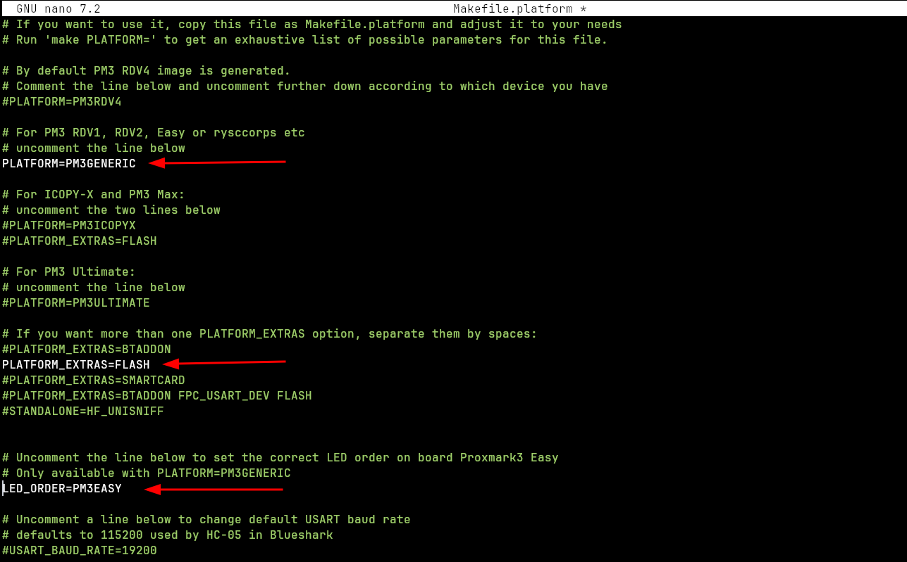
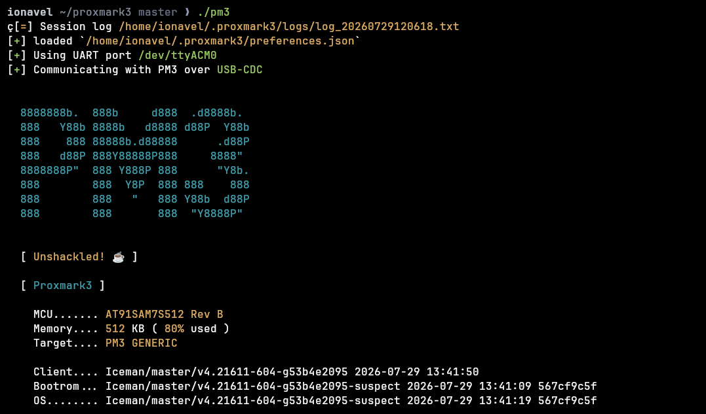
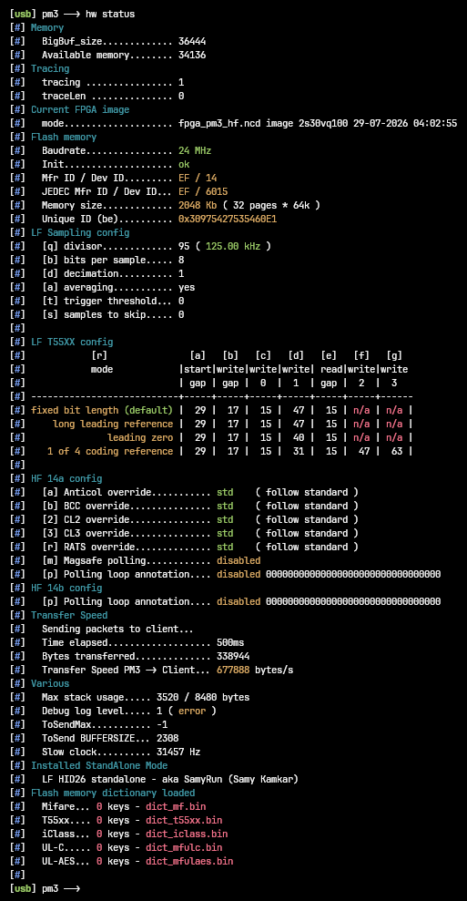
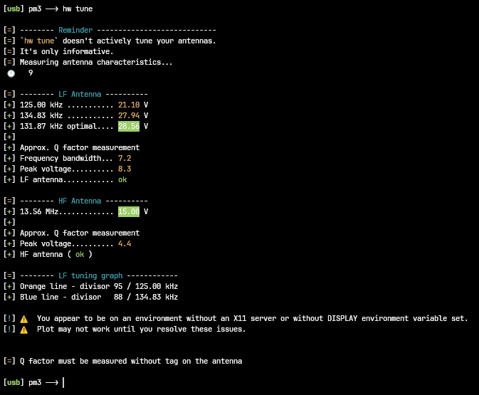
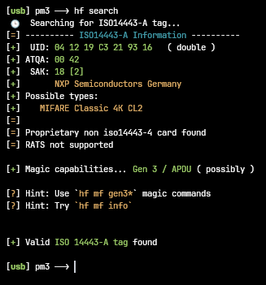
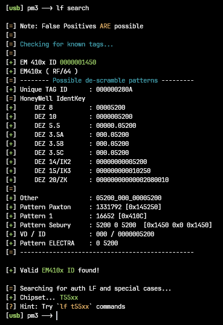
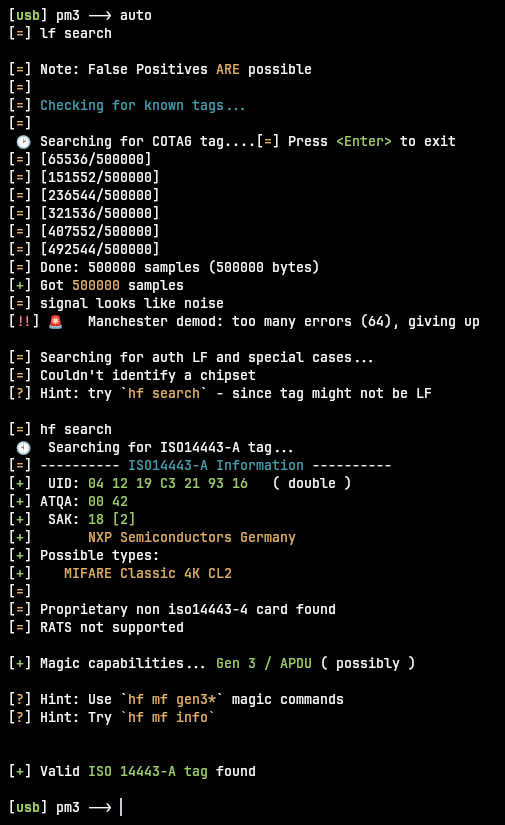
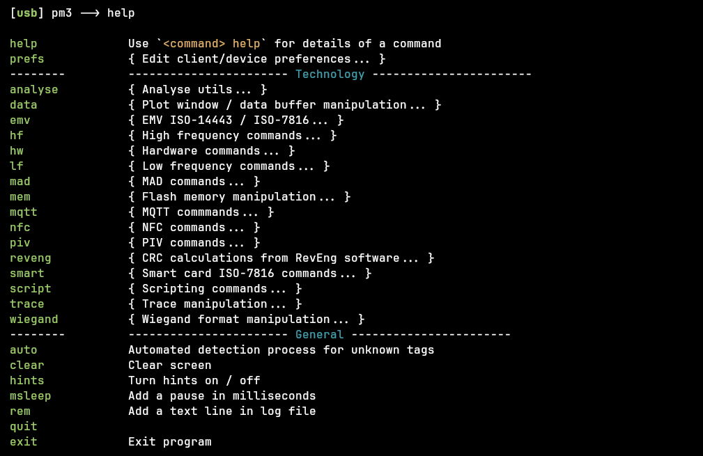

In this post I take my first steps with a Proxmark3. In my case it's a Chinese clone I bought on AliExpress, but it's more than enough for basic research and learning.

My goal is simple: get it up and running on my Linux machine and figure out exactly what I have in my hands.

# What I'm using

- A Proxmark3 Chinese clone. Its has an **LF antenna** (`LF_ANT_500UH`, center freq 125 kHz) and the **HF antenna** (13.56 MHz). 


- A "magic card" (HF) and a blank/rewritable tag (LF) to test with. Both are cards you can rewrite, which makes them perfect for practicing.


- The software: the [Iceman Fork - Proxmark3](https://github.com/RfidResearchGroup/proxmark3). This is the actively maintained fork. 

# Installing dependencies

First we install everything needed to build the project. I start by updating the system:

```
ionavel ~ ❯ sudo apt-get update
sudo apt-get upgrade -y
sudo apt-get auto-remove -y
```

Then the actual build dependencies (this list is for my Ubuntu):

```
ionavel ~ ❯ sudo apt-get install --no-install-recommends git ca-certificates build-essential pkg-config libreadline-dev gcc-arm-none-eabi libnewlib-dev qt6-base-dev libbz2-dev liblz4-dev zlib1g-dev libbluetooth-dev libpython3-dev libssl-dev libgd-dev
```


## Disable ModemManager

This step is **important**. ModemManager tries to talk to any serial device as if it were a modem, and it can corrupt the firmware while flashing. I stop and disable it:

```
ionavel ~ ❯ sudo systemctl stop ModemManager
ionavel ~ ❯ sudo systemctl disable ModemManager
```

# Getting the source

Now I clone the repository:

```
ionavel ~ ❯ cd ~
git clone https://github.com/RfidResearchGroup/proxmark3.git
cd proxmark3
Cloning into 'proxmark3'...
remote: Enumerating objects: 128300, done.
remote: Counting objects: 100% (445/445), done.
remote: Compressing objects: 100% (161/161), done.
remote: Total 128300 (delta 313), reused 306 (delta 284), pack-reused 127855 (from 3)
Receiving objects: 100% (128300/128300), 92.13 MiB | 22.04 MiB/s, done.
Resolving deltas: 100% (100251/100251), done.
ionavel ~/proxmark3 master ❯
```

# Choosing my platform

This is the most important part, and where it's easy to shoot yourself in the foot. Before compiling I need to tell the build what kind of board I actually have. I copy the sample config and open it:

```
ionavel ~/proxmark3 master ❯ cp Makefile.platform.sample Makefile.platform
ionavel ~/proxmark3 master ❯ nano Makefile.platform
```

> **Watch out:** by default the sample builds for **PM3RDV4**. My generic Chinese clone is **not** an RDV4, so if you leave the default you'll flash the wrong firmware. It might even seem to work, but `hw tune` will later complain with something like *"running a PM3_RDV4 firmware on a generic device"* and report bogus antenna readings. Set the platform that matches your board.

For my clone I comment out the RDV4 line and set:

- `PLATFORM=PM3GENERIC` — the correct platform for a generic clone.
- `PLATFORM_EXTRAS=FLASH` — my board has an onboard SPI flash chip, so I enable it to keep that storage (dictionaries, dumps).
- `LED_ORDER=PM3EASY` — optional, fixes the LED order on Proxmark3 Easy boards.



With that set, I build. I add `SKIPQT=1` because I don't use the graphical part and it avoids a Qt/Wayland crash (more on that in the Problems section:

```
ionavel ~/proxmark3 master ❯ make clean && make -j$(nproc) SKIPQT=1

=================================================================<mark>
Version info:      Iceman/master/v4.21611-604-g53b4e2095
Platform name:     Proxmark3 GENERIC
PLATFORM:          PM3GENERIC
PLATFORM_FPGA:     xc2s30
PLATFORM_SIZE:     512
Platform extras:   FLASH
Standalone mode:   LF_SAMYRUN
</mark>=================================================================
```

The important thing to check here is `Platform name: Proxmark3 GENERIC`. If it still says RDV4, go back and fix the Makefile before flashing.

# Installing and flashing

Now I install the client and add my user to the `dialout` group so I don't need `sudo` to access the serial port every time:

```
ionavel ~/proxmark3 master ❯ sudo make install
ionavel ~/proxmark3 master ❯ sudo usermod -aG dialout $USER
```

> The `dialout` change doesn't apply to terminals that were already open. If you skip the step in the next section, running the client without `sudo` will fail with an "invalid serial port" error.

Then I flash the firmware. This is required so client and firmware are the exact same build:

```
ionavel ~/proxmark3 master ❯ sudo ./pm3-flash-all

[...]

[+] All done

[=] Have a nice day!

ionavel ~/proxmark3 master ❯
```

To use the `dialout` group in the current terminal without logging out:

```
ionavel ~/proxmark3 master ❯ newgrp dialout
```

# First run

Everything is in place, so I launch the client:

```
ionavel ~/proxmark3 master ❯ ./pm3
```



The key line is `Communicating with PM3 over USB-CDC` — that means the client is talking to the board. And in the banner I can confirm `Target.... PM3 GENERIC`, so the platform matches.

# Verifying everything works

Now that the client opens, I want to confirm the whole thing actually works before trusting it. I do this in three steps: check the hardware, check the antennas, and finally read a real card.

## Hardware info

This command is the "spec sheet" of the board. It tells me what I really have, beyond whatever the AliExpress listing claimed:

```
[usb] pm3 --> hw status
```



A few things worth noticing:

- **Flash memory → `Init.... ok`** and `Memory size... 2048 Kb`: my clone does have a working 2 MB SPI flash. That's the storage I enabled with `PLATFORM_EXTRAS=FLASH`.
- **Standalone mode**: `LF HID26 standalone - aka SamyRun`. This is the module that runs when the Proxmark works on its own, powered by battery, with no computer.

## Antenna check

Next I measure the antennas:

```
[usb] pm3 --> hw tune
```



Both antennas report `ok`: LF around 21 V and HF around 15 V. On a clone those values are perfectly usable.

> `hw tune` is **only informative**, it doesn't actually tune anything. It's a general indicator: if an antenna shows `unusable` instead of `ok`, it's worth checking. Also, measure it **without any card on top**, or the reading gets skewed.

## The real test: reading cards

The measurements are nice, but the real proof is reading an actual card with each antenna. Remember the two antenna zones from the board photo: the HF card goes on the flat area, the LF tag goes on the round coil.

### HF antenna (13.56 MHz)

I place the magic card on the HF antenna and run:

```
[usb] pm3 --> hf search
```



It reads the card correctly and gives me some useful information about what I'm holding:

- **UID: `04 12 19 C3 21 93 16` (double)** — the unique identifier. Starting with `04` means NXP, and "double" means a 7-byte UID.
- **SAK: `18`** — a byte that announces the card type. Here it maps to **MIFARE Classic 4K CL2**.
- **Magic capabilities... Gen 3 / APDU (possibly)** — this tells me it's not a normal MIFARE but a **magic card**: one where you can even change the UID. Exactly what you want for cloning practice. The client even suggests the `hf mf gen3*` commands.

### LF antenna (125 kHz)

Now the low frequency tag. I put it on the round coil and run:

```
[usb] pm3 --> lf search
```



- **EM 410x ID `0000001450`** — one of the most common LF tag types, and here's its ID.
- **EM410x ( RF/64 )** — the modulation/encoding scheme the chip uses.
- **The long "de-scramble patterns" table** — the same ID shown in many notations (DEZ 8, DEZ 10, Paxton, Sebury...). Different access-control vendors print the ID differently, so this table lets you match whatever number is printed on your physical tag. They're not different IDs, just **different formats of the same one**.
- **Chipset... T55xx** — this is the interesting bit. The Proxmark keeps probing and finds the underlying chip is a **T5577**, a rewritable chip that can *emulate* an EM410x. In other words, this isn't a factory EM410x, it's the LF equivalent of the magic card.

So both antennas read correctly, and as a bonus I have one rewritable card per band, which is exactly what I'll need for the cloning experiments later on.

# Modes and basic commands

To wrap up the setup, here's a quick overview of how the Proxmark works.

At its core it operates in **three modes**:

- **Reader** — acts as an RFID reader. This is what I did above with `hf search` and `lf search`.
- **Sniffer** — sits between a real reader and a card and intercepts the communication without interfering.
- **Emulator** — pretends to be a card in front of a real reader. This is the basis of cloning.

A handy command when you don't know what you're facing is `auto`, which runs an automated detection process and tries every band for you:

```
[usb] pm3 --> auto
```



And to see everything the client can do, `help` lists all command families (`hf`, `lf`, `hw`, `data`, `mem`...):

```
[usb] pm3 --> help
```



Two tips that make life easier: any command with `-h` explains its options (for example `hf mf -h`), and the client supports **Tab autocomplete** for commands and filenames, just like a normal shell.

# Problems I ran into

The main flow above is the clean, working path. Along the way I hit a few bumps that are worth documenting, in case you run into the same.

## "invalid serial port" even though the port exists

The first time I ran the client without `sudo` it failed:

```
[!] ⚠️  ERROR: invalid serial port /dev/ttyACM0
```

...even though `./pm3 --list` clearly showed the port. The cause wasn't a missing port, it was **permissions**: my user was already added to `dialout`, but the change hadn't applied to that terminal session. The fix is `newgrp dialout` (or logging out and back in once, which makes it permanent).

> Quick way to confirm it's permissions: if `sudo ./pm3` works but `./pm3` doesn't, it's the `dialout` group.

## The client crashes on Wayland (Qt error)

Once permissions were fixed, the client connected to the board but then crashed:

```
[+] Communicating with PM3 over USB-CDC
...
qt.qpa.xcb: could not connect to display :1
./pm3: line 253: Aborted (core dumped)
```

The important detail is that `Communicating with PM3 over USB-CDC` line: the hardware was fine, this is purely a graphics problem. The client is built with Qt for the antenna plot window, and on Wayland the X11 plugin fails to initialize.

Two options:

- **Temporary**, without rebuilding, tell Qt not to open a window:

```
QT_QPA_PLATFORM=offscreen ./pm3
```

- **Permanent**, rebuild the client without Qt (this is what I did, since I don't use the plot):

```
ionavel ~/proxmark3 master ❯ make clean && make -j$(nproc) SKIPQT=1
ionavel ~/proxmark3 master ❯ sudo make install
```

After that, `./pm3` boots straight to the console. You'll see a harmless warning in `hw tune` about no X11 server, which just means it can't draw the plot window. Everything else works.

## I flashed the wrong platform (RDV4 on a generic board)

As mentioned earlier, the sample Makefile defaults to `PM3RDV4`. I built with the default the first time, and `hw tune` flagged it: it warned about running RDV4 firmware on a generic device and reported the HF antenna as `unusable`, a false positive (the card actually read fine). Switching to `PLATFORM=PM3GENERIC`, rebuilding and reflashing fixed both the warning and the readings.

# Resources

- **Official RRG (RfidResearchGroup)** – firmware, client and documentation: [Proxmark3 GitHub](https://github.com/RfidResearchGroup/proxmark3)
- **Command reference** – the full list, with a column showing whether each command works offline: [commands.md](https://github.com/RfidResearchGroup/proxmark3/blob/master/doc/commands.md)
- **Cheat sheet** – the most common commands per technology: [cheatsheet.md](https://github.com/RfidResearchGroup/proxmark3/blob/master/doc/cheatsheet.md)


That's the setup done. From here on I have a working Proxmark3 and two rewritable cards, so the next posts will get into actual experiments and proofs of concept.
